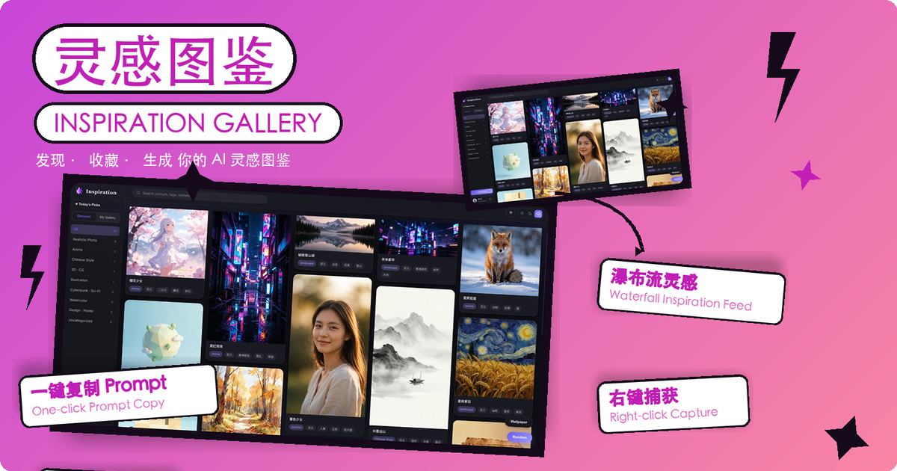
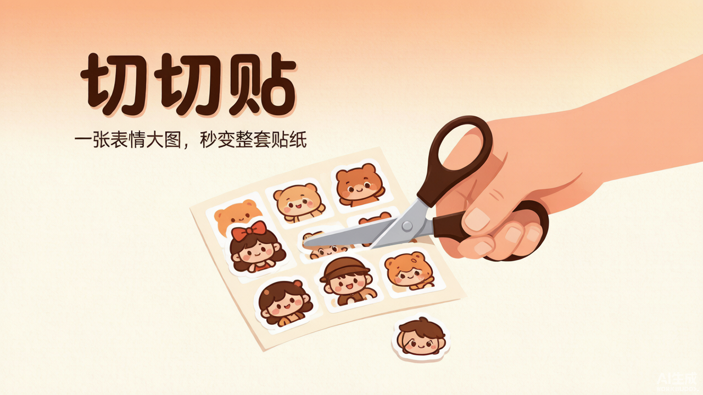
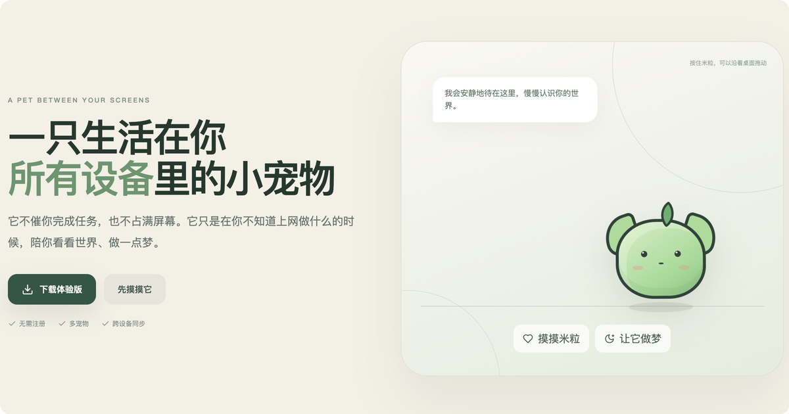

<h1 align="center">Hi there 👋</h1>

  <b>I am Will Lee</b> · 做有趣的小产品

---

<table>
<tr>
<td align="center" width="50%">

<b>🎨 灵感图鉴</b> · 发现 / 收藏 / 投稿 AI 图片 Prompt

微信小程序 + Chrome 插件

</td>
<td align="center" width="50%">

<b>✂️ 切切贴</b> · 一张大图秒变整套贴纸

WEB 静态站 · 本地运行

</td>
</tr>
<tr>
<td align="center" width="50%">

<b>🐻 小画屿</b> · 2–5 岁儿童的互动故事绘本

微信小程序

</td>
<td align="center" width="50%">

<b>🐱 vPet</b> · 生活在你设备里的小宠物

Mac 桌面端 · Web

</td>
</tr>
</table>
